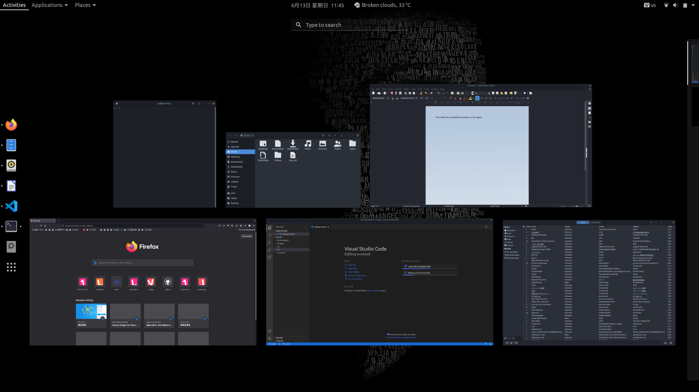
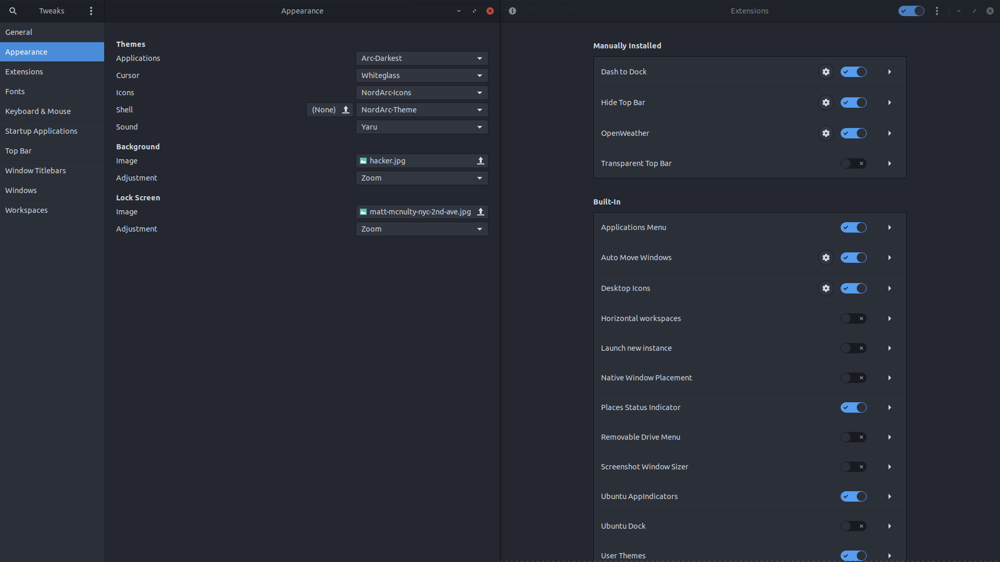
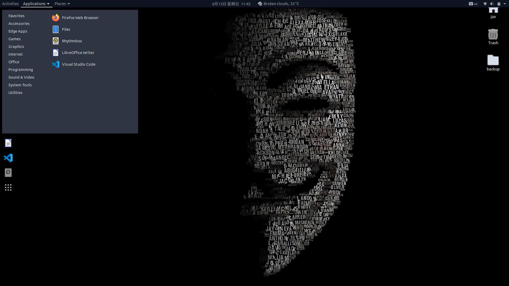
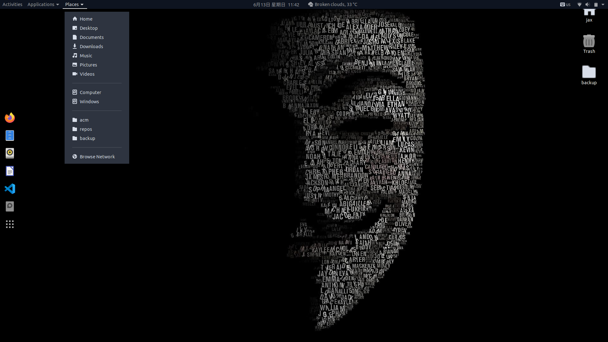
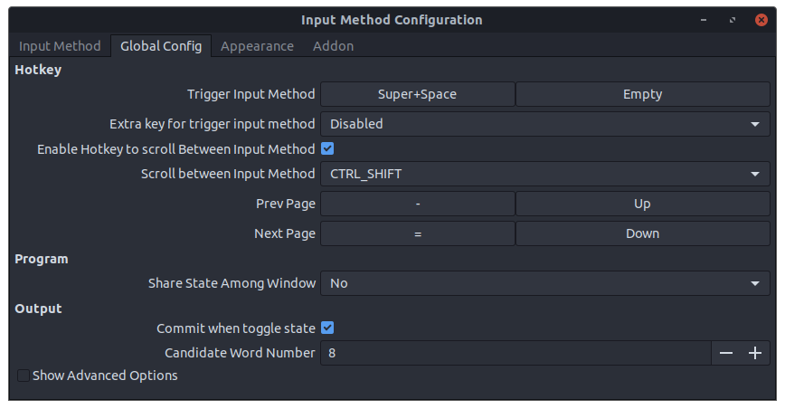
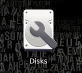
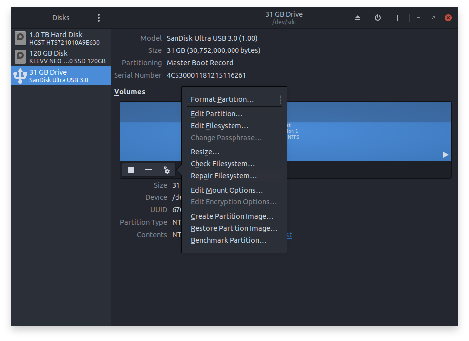

# Note for Ubuntu 20.04

> Focus on configuration backup & restore.
>
> System notes will be updated on Notion.

## TOC

- [1. Install Ubuntu 20.04](#1-install-ubuntu-2004)

- [2. Install & configure softwares](#2-install-configure-softwares)

- [3. Configure Devenvironment](#3-configure-devenvironment)

- [4. Backup](#4-backup)

- [5. Other configuration](#5-other-configuration)

- [6. Common commands](#6-common-commandes)

- [7. Extra operation](#7-extra-operation)

- [8. Trouble shooting](#8-trouble-shooting)

- [Reference](#reference)

## 1. Install Ubuntu 20.04

The first step after you booted from USB flash drive is to select keyboard layout and language. I would recommend you to remain the default, so that the folders' names will remain in English. And you could change computer's language later.  

### 1.1. Allocate drive space

1. `/`

	| key            | value                      |
	| -------------- | -------------------------- |
	| size           | 150 GiB (bigger is better) |
	| partition type | primary                    |
	| file type      | ext4                       |
	| mount poiont   | /                          |
	
2. `/boot`

	| key            | value                            |
	| -------------- | -------------------------------- |
	| size           | 1GiB (fast drive is recommended) |
	| partition type | logical                          |
	| file type      | ext4                             |
	| mount poiont   | /boot                            |

3. `/swap`

	| key            | value                        |
	| -------------- | ---------------------------- |
	| size           | 8GiB (same size as your RAM) |
	| partition type | logical                      |
	| file type      | swap                         |

4. `/var` (optimical)

	| key            | value                      |
	| -------------- | -------------------------- |
	| size           | 46 GiB  (may be too large) |
	| partition type | logical                    |
	| file type      | ext4                       |
	| mount poiont   | /var                       |

5. `/home`
	| key            | value                                         |
	| -------------- | --------------------------------------------- |
	| size           | 347 GiB (all memory lefted, larger is better) |
	| partition type | logical                                       |
	| file type      | ext4                                          |
	| mount poiont   | /home                                         |


## 2. Install & configure softwares

You may need to excute `sudo apt update` to update software source first before installing any software.  

### 2.1. Update system built-in softwares

It's a nice choice to do this later, because you can only update or install a single software at the same time. And this process may be time consuming. So I would recommend you to install some tool softwares like vim first (Ubuntu has a built-in vim-tiny, but it's not powerful as vim).

commands:  
```bash
sudo apt update
sudo apt upgrade -y	# -y means yes
```

### 2.2. Install tool softwares

There are many tool softwares you could choose, I'll list some of them. You could choose some to install.  

Remember run `sudo apt update` first.  

1. vim (Powerful text editor)  
	```bash
	sudo apt install vim -y
	```

2. git (Version control system)
	```bash
	sudo apt install git -y
	```

3. oh-my-zsh (A shell makes you look like a PRO)  

	You can find more information in [ohmyzsh repo](https://github.com/)
	```bash
	sudo apt install zsh -y	# install zsh first
	sudo chsh -s /bin/zsh	# change default shell to zsh

	# intall oh-my-zsh
	wget https://github.com/robbyrussell/oh-my-zsh/raw/master/tools/install.sh -O - | sh

	# manual install
	git clone git://github.com/robbyrussell/oh-my-zsh.git ~/.oh-my-zsh
	cp ~/.oh-my-zsh/templates/zshrc.zsh-template ~/.zshrc
	````

4. VS Code (My favorite editor)  

	You can download it from Ubuntu store or from it's [official website](https://code.visualstudio.com/).  
	I would recommend the second way, because the Ubuntu sotre version is different from the official version and contains some bugs.  
	1. Download the right ".deb" package at the official website.  
	2. Install the package with command:  
		```bash
		# open the .deb package folder in termianl first
		sudo apt install <package name>.deb
		```

5. fcitx (stands for "Free Chinese Input Toy for X", which is better than Ubuntu built-in ibus)  

	1. Remove ibus first, or ibus may effect fcitx:  
		```bash
		sudo apt remove ibus -y
		sudo apt autoremove -y
		```
	2. Install fcitx frame and input method from Ubuntu official repo:  
		```bash
		sudo apt install fcitx fcitx-pinyin -y
		```
	3. Run this command and follow prompt to select fcitx as default input method:  

		```bash
		im-config -n fcitx
		```
	4. Reboot your computer to use fcitx.  
	5. You can change the skin name in the advance options. I would like to change "default" to "dark".    

6. vlc (The most powerful media player)  
	```bash
	sudo apt install vlc -y
	```

7. Edge-Beta (Microsoft broswer)  

	Microsoft hasn't release the stable version of Edge, so I choose to install the beta version.  
	1. download ".deb" package from [Microsoft Edge Insider](https://www.microsoftedgeinsider.com/)  

	2. open the ".deb" package folder in terminal:  
		```bash
		sudo apt install ./<package name>.deb -y
		```

8. Chrome (is similar to Edge)  

9. JetBrains Toolbox App (The official software for installing  & managing JetBrains's IDEs)  

	1. download ".tar.gz" archieve from [Toolbox App](https://www.jetbrains.com/toolbox-app/).  
	2. open archieve's folder in terminal and unzip it:  
		```bash
		tar zxvf ./<archieve name>.tar.gz
		```
	3. run unzipped subfolder's binary to install:  
		```bash
		# folder name varies from different versions
		# be patient to wait until Toolbox icon shown in your menu
		sudo ./jetbrains-toolbox-1.20.8804/jetbrains-toolbox
		```

10. Some other useful command line tools:  
	```bash
	sudo apt install tree cmake make
	```

11. VirtualBox:  
	```bash
	sudo apt install virtualbox
	```

12. MySQL Server:

	```bash
	sudo apt install mysql-server -y
	sudo systemctl disable mysql --now	# disable mysql when not need
	sudo systemctl enable mysql --now	# enable mysql when need
	```

13. Java JDK:

	```bash
	# IDEA can detect this JDK
	sudo apt install openjdk-16-jdk -y
	```

14. xclip:

	A command line interface for clipboard.

	```bash
	# install
	sudo apt install xclip
	# usage: copy a file content to clipboard
	cat test.txt | xclip
	# usage: output the cilpboard content to standard output
	xclip -o
	```

15. Install Manim by following instructions on [Manim Community](https://docs.manim.community/en/stable/installation/linux.html):

	1. Intall dependencies:

		```shell
		sudo apt update
		sudo apt upgrade -y

		# install cairo
		sudo apt install libcairo2-dev -y

		# install Pango
		sudo apt install libpango1.0-dev -y

		# install ffmpeg
		sudo apt install ffmpeg -y
		
		# install LaTeX
		# Note: The LaTeX installation may take up a lot of space (~ 2 GB).
		#		The manim community developers are currently working on providing
		#		a simpler, lighter LaTeX package for us to install.
		sudo apt install texlive texlive-latex-extra texlive-fonts-extra \
		texlive-latex-recommended texlive-science texlive-fonts-extra tipa

		# if no python3-pip installed, install it
		sudo apt install python3-pip
		```

	2. Certifying a clean install:

		```shell
		ffmpeg -version

		# press CTRL + C to exit
		latex
		```

	3. Intall Manim:

		```shell
		pip3 install manim
		```

	4. Go to [Quickstart](https://docs.manim.community/en/stable/tutorials/quickstart.html) to verify installation.

	5. Troubleshooting

		1. xelatex: not found

			```shell
			# install texlive-xetex which contains xelatex
			sudo apt install texlive-xetex -y
			```

	6. Further Study: use [Manim Docker image](https://hub.docker.com/r/manimcommunity/manim)

16. youtube-dl:

	```shell
	sudo curl -L https://yt-dl.org/downloads/latest/youtube-dl -o /usr/local/bin/youtube-dl
	sudo chmod a+rx /usr/local/bin/youtube-dl
	```

## 3. Configure Devenvironment

### 3.1 Configuration

#### 3.1.0 Configuration Example

- Git

	- [.gitconfig](../examples/git/.gitconfig)

- VIM

	- [.vimrc](../examples/vim/.vimrc)

- ZSH

	- [.zshrc](../examples/zsh/.zshrc)

- Maven

	- [settings.xml](../examples/maven/settings.xml)

#### 3.1.1 Configuration File

- VIM

	- [.vimrc](../configs/vim/.vimrc)

- ZSH

	> Usaully, using [oh-my-zsh](https://ohmyz.sh/) to configure ZSH is enough.

	- [.zshrc](.zshrc)
	

### 3.2 Restore Configuration

Git: refer to [.gitconfig](../examples/git/.gitconfig)

VIM:

- [restore_vim.sh](./restore_vim.sh)

ZSH: refer to [./.zshrc](./.zshrc) & [examples/zsh/.zshrc](../examples/zsh/.zshrc)

### 3.2 Quick Setup

> You should execute `sudo apt update` before executing some scripts.

- Install basic tools: [install_basic_tools.sh](./install_basic_tools.sh)

- Install Oh My ZSH: [install_ohmyzsh.sh](./install_ohmyzsh.sh)

- Install Oh My ZSH plugins: [install_ohmyzsh_plugins.sh](./install_ohmyzsh_plugins.sh)

	You should enable plugins in [~/.zshrc](~/.zshrc)

Quick Setup:

- [generate_quick_setup.sh](./generate_quick_setup.sh)

- [quick_setup.sh](./quick_setup.sh)

## 4. Backup

> Most of time, you need refer to [3. Configure Devenvironment](#3-configure-devenvironment) to manually backup your configuration.

## 5. Other configuration

### 5.1. Configure SSH

> SSH key must be in mode "600" to avoid being stolen by others.

1. Enable ssh server:
	```shell
	# install
	sudo apt install openssh-server -y
	# look up running status
	systemctl status ssh
	# disable the firewall to allow remote connection
	sudo ufw allow ssh
	```

2. Generate ssh key:  
	```bash
	ssh-keygen -t ed25519 -C "your_email@example.com"
	```

3. Copy ssh public key to server:
	```shell
	ssh-copy-id <remote_username>@<server_ip_address>
	
	# use this if ssh-copy-id encountered error
	cat ~/.ssh/id_rsa.pub | ssh remote_username@server_ip_address "mkdir -p ~/.ssh && chmod 700 ~/.ssh && cat >> ~/.ssh/authorized_keys && chmod 600 ~/.ssh/authorized_keys"
	```

4. Edit ssh configuration file:

	The configuration file is located at </etc/ssh/sshd_config>, you can edit following options to disable password authentication:
	```text
	PasswordAuthentication no
	ChallengeResponseAuthentication no
	UsePAM no
	```

5. Remeber to restart ssh after edit configuration file:
	```shell
	sudo systemctl restart ssh
	```


### 5.2. Desktop beautify

1. Install custom softwares:  
	```bash
	# used for managing system themes
	sudo apt install gnome-tweak-tool -y
	# enable extension support on gnome
	sudo apt install gnome-shell-extensions
	# enable chrome to install gnome extensions
	sudo apt install chrome-gnome-shell	# required to install extension in chrome store
	```

2. Download themes or extensions  

	You can find themes on [GNOME-LOOK.ORG](https://www.gnome-look.org/).  
	Extensions are avaliable on <https://extensions.gnome.org/>.  

3. Here is my configuration list:  

	For Tweaks:

	| Type         | Theme         |
	| ------------ | ------------- |
	| Applications | Arc-Darkest   |
	| Cursor       | Whiteglass    |
	| Icons        | NordArc-Icons |
	| Shell        | NordArc-Theme |
	| Sound        | Yaru          |

	For Extensions:

	| Enabled                 |Description                       |
	| ----------------------- | -------------------------------- |
	| Applications menu       | built-in                         |
	| Auto move windows       | built-in                         |
	| Dash to dock            | customize dock                   |
	| Desktop Icons           | built-in                         |
	| Hide top bar            | same as the name                 |
	| Openweather             | show weather on top bar          |
	| Places status indicator | built-in                         |
	| Uesr themes             | Enable Shell theme customization |

4. Final display:  
	
	
	
	
	

### 5.3 Configure root user

1. copy ".vimrc" to "/root":

	```bash
	sudo cp ~/.vimrc /root
	```

### 5.4 Add windows fonts

1. copy all file in `C:\\Windows\Fonts` to a zip named `windows-fonts.zip`.

2. unzip this zip file and copy it to `/usr/share/fonts`:
	
	```shell
	unzip windows-fonts.zip -d windows-fonts
	sudo mv windows-fonts /usr/share/fonts
	```

3. configure grant option:
	
	```shell
	cd /usr/share/fonts
	sudo chmod -R 644 windows-fonts && sudo chmod 755 windows-fonts
	```

4. update fonts cache:
	
	```shell
	cd /usr/share/fonts/windows-fonts
	sudo mkfontscale

	# you may see error with this command, if so delete all file with .fon postfix and run before the above command again
	sudo mkfontdir
	sudo fc-cache -fv
	```

5. reboot your system:
	
	```shell
	sudo reboot
	```

### 5.5 Configure Python

1. make python as python3:

	```shell
	sudo ln -s /usr/bin/python3 /usr/bin/python
	```

### 5.6 Configure Vim

1. add Vim package:

	1. add kotlin support for Vim:

		```shell
		git clone https://github.com/udalov/kotlin-vim.git ~/.vim/pack/plugins/start/kotlin-vim
		```

## 6. Common commands

This could be a single topic, but if you know little commands, you will find it hard to configure your linux distros.  

### 6.1. Package management

1. Update package source:  
	```bash
	sudo apt update
	```

2. Upgrade packages intalled:  
	```bash
	sudo apt upgrade -y
	```

3. Remove packages not need automatically:  
	```bash
	sudo apt autoremove -y
	```

4. Delete packages file not need automatically:  
	```bash
	sudo apt autoclean -y
	```

### 6.2 Commands for help message

1. Look for Vim insert mode shortcuts:

	```shell
	# input this in Vim's "Last-line mode"
	:help ins-special-keys
	```

## 7. Extra operation

### 7.1. Keyboard shortcuts

1. fcitx's hotkey "Trigger Input Method" uses "Ctrl + Space" conflicts with VS Code.

	Solution: First disable the system shortcut "Super + Space" and then change fcitx's hotkey to "Super + Space":  
	  

### 7.2. Disable sudo password

By default, you have to enter password to use sudo after a while. To avoid frequent repetition, we can disable password for sudo as follows.  

1. Run `sudo visudo` to open the configuration file.  
2. Change **"%sudo ALL=(ALL:ALL)"** to **"%sudo ALL=(ALL:ALL) NOPASSWD:ALL"**.  

### 7.3. Remove unnecessary package

```bash
sudo apt remove vim-tiny	# unnecessary if you installed vim
```

### 7.4 Enable firewall

```bash
sudo ufw enable
sudo ufw status	# used to show the firewall status
```

### 7.5 内网穿透

> 也可参考官网教程：[花生壳5.0 for Linux使用教程](https://service.oray.com/question/11630.html)


1. 下载并安装花生壳：<https://hsk.oray.com/download/>

2. 安装后花生壳会自启动，也可以通过命令控制

	1. 启动：
		```shell
		phddns start
		```

	2. 停止：
		```shell
		phddns stop
		```

	3. 查看状态：
		```shell
		phddns status
		```

3. 配置映射：

	1. 先在之前下载花生壳的[官网](https://hsk.oray.com/)注册 Oray 帐号并登录，
	打开 <http://b.oray.com>，并使用 `phddns status` 显示的帐号信息登录，之后会要求绑定 Oray 帐号，绑定才能使用。

	2. （可选）第一步可以通过先在 <https://console.hsk.oray.com/device> 登录然后添加设备完成。建议在绑定成功后修改设备密码。

	3. 到 <https://console.hsk.oray.com/forward> 添加映射，内网主机号可用命令 `ip a` 查看。
	
		

	4. 记住生成的域名和端口号，使用 `ssh -p <端口号> <用户名>@<域名>` 测试能否登录。

## 8. Trouble shooting

1. When I plug in USB disk, it prompts `error mounting dev/sdc1 at...`  
	Solution: repair filesystem in "Disks" (Ubuntu built-in application).  
	  
	  

2. Edge may close unexpectedly, espicially when you didn't connect to Internet.  

3. If you have trouble with fcitx, check this out: [Manjaro中文输入法（fcitx+googlepinyin)的配置问题](https://manjaro.org.cn/bbs/topic/manjaro%E4%B8%AD%E6%96%87%E8%BE%93%E5%85%A5%E6%B3%95%EF%BC%88fcitxgooglepinyin%E7%9A%84%E9%85%8D%E7%BD%AE%E9%97%AE%E9%A2%98).  

## Reference

- [花生壳5.0 for Linux使用教程](https://service.oray.com/question/11630.html)

- [Vim 101: Insert Mode Shortcuts](https://medium.com/usevim/vim-101-insert-mode-shortcuts-3401724079ee#:~:text=Vim%20101%3A%20Insert%20Mode%20Shortcuts.%20When%20editing%20a,%28%20%3Ahelp%20i_CTRL-U%29%20will%20delete%20the%20current%20line.)

- [VIM Keyboard Shortcuts Cheatsheet](https://www.maketecheasier.com/cheatsheet/vim-keyboard-shortcuts/)

- [XeLatex under Ubuntu](https://tex.stackexchange.com/questions/179778/xelatex-under-ubuntu)

- [kotlin-vim](https://github.com/udalov/kotlin-vim)
