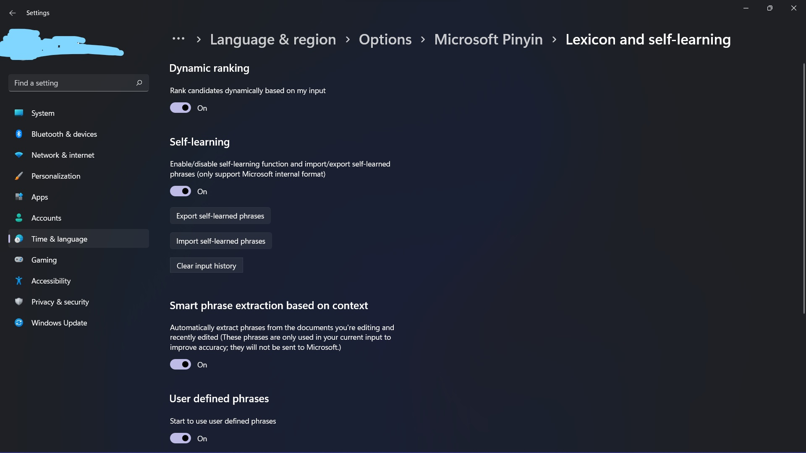

# Note for Windows 11

## TOC

- [1. 配置系统](#1-配置系统)

- [2. 安装开发工具](#2-安装开发工具)

- [3. 配置开发环境](#3-配置开发环境)

- [4. 备份](#3-备份)

## 1. 配置系统

## 2. 安装开发工具

### 2.1 直接官网安装

- [VS Code](https://code.visualstudio.com/download)

- [Git](https://git-scm.com/downloads)

### 2.2 微软商店安装

- [Windows Terminal](https://www.microsoft.com/zh-cn/p/windows-terminal/9n0dx20hk701?activetab=pivot:overviewtab)

### 2.3 命令行安装

- [PowerShell 7](https://docs.microsoft.com/en-us/powershell/scripting/whats-new/migrating-from-windows-powershell-51-to-powershell-7?view=powershell-7.2):

    ```powershell
    # 使用 winget
    winget install --id Microsoft.Powershell --source winget
    ```

- [WSL](https://docs.microsoft.com/en-us/windows/wsl/install):

    ```powershell
    # 默认安装 Ubuntu；需要重启
    wsl --install
    ```

### 2.4 工具包下载

- [MinGW](https://nuwen.net/mingw.html)

## 3. 配置开发环境

### 3.1 配置文件

配置示例：

- Git

    - [.gitconfig](../examples/git/.gitconfig)

### 3.2 恢复配置

> 需要使用 [4.3 备份脚本](#4-3-备份脚本)先备份

Git: 参考 [.gitconfig](../examples/git/.gitconfig) 手动配置

### 3.3 PowerShell

- 设置执行策略为 `RemoteSigned` 以允许执行脚本：

    > PowerShell 7 默认的执行策略是 `RemoteSigned`，无需此操作
    >
    > 建议不要使用 PowerShell 5.x，一堆 BUG
    

    ```powershell
    # 使用管理员权限执行
    Set-ExecutionPolicy -ExecutionPolicy RemoteSigned
    ```

### 3.4 OpenSSH

生成密钥：

```powershell
ssh-keygen -t ed25519 -C "your_email@example.com"
```

## 4. 备份

> 加入必要的恢复备份说明

### 4.3 备份脚本

> [3.2 恢复配置](#3-2-恢复配置)的基础

WSL:

- [export_ubuntu.ps1](export_ubuntu.ps1)

### 4.2 输入法备份

导出输入法词库：



### 4.3 备份 WSL

> Reference: https://docs.microsoft.com/en-us/windows/wsl/use-custom-distro

`wsl --install` 只能安装到 C 盘，用 `wsl --import` 可以安装到其它盘。

由于 Windows 经常出 BUG，建议定期备份。

导出 WSL：

```powershell
wsl --terminate <distro_name>
wsl --export <distro_name> <backup_file_name>.tar
```

导入 WSL：

```powershell
# <install_localtion> 可以在任意盘
wsl --import <distro_name> <install_location> <backup_file_name>.tar
```